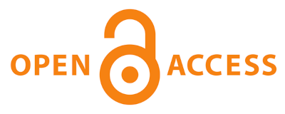
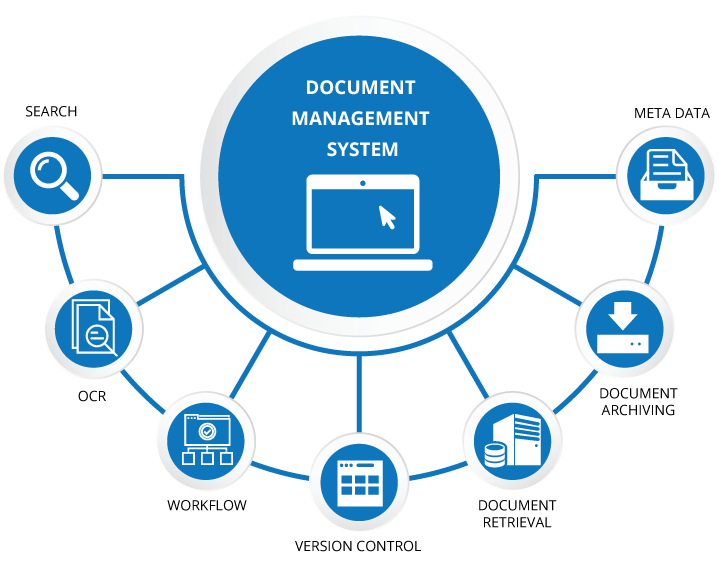

# QUE É UN REPOSITORIO DIXITAL?

---

## A **inxente cantidade de información**, en todo tipo de formatos, que se xera e consulta na actualidade produce un **problema colateral** para as organizacións: atopar **como publicala e xestionala** para que sexa facilmente identificada, consultada e compartida por todos os interesados.

---

## Unha das posibles solucións é a creación de **repositorios dixitais** onde se catalogue e organice toda esa información, ou alo menos aquela que pode ser de utilidade.

---

## DEFINICIÓN DE REPOSITORIO DIXITAL

---

## Os repositorios dixitais son basicamente **arquivos onde se almacenan os recursos dixitais para poder ser consultados a través de internet**. Un repositorio dixital pode albergar todo tipo de formatos dixitais: libros electrónicos, documentos en todo tipo de formatos -pdf, json, xml, doc,...-, vídeos, fotos, animacións...

---

## Na súa orixe os repositorios foron un instrumento para a difusión dos metadatos de preprint (borradores) e de servidores de e-print (ediciones preliminares electrónicas).

---

## Nese contexto se creou o Protocolo de Arquivos Abertos para Recolección de Metadatos, coñecido comúnmente polas siglas en inglés de *Open Archives Initiative Protocol for Metadata Harvesting* (OAI-PMH).

---

## OAI-PMH acabou convertido nunha solución amplamente coñecida e aceptada para conectar repositorios electrónicos distribuidos de moitas clases, en boa parte debido a súa simplicidade e os baixos custee de implantación.

---

## Algún dos tipos de repositorio dixital se asocia en xeral ao [ámbito universitario, investigador e docente](https://www.udc.es/es/biblioteca/servizos/apoio_investigacion/recursos_info/repositorios_acceso_aberto/). Este tipo de repositorios foron algúns dos primeiros en aparecer. Pero os avances na tecnoloxía enseguida promoveron estes instrumentos documentais e de administración de datos como ferramentas que poden **ser empregadas por calquera empresa ou organización** que se propoña como obxectivo recoller, xestionar e preservar calquera tipo de produción. O obxectivo final é **garantir a consulta e visibilidade de toda esa información**.

---

> ## Cos repositorios dixitais se trata de crear un modelo de control, visibilidade e diseminación de información dixital de bibliotecas, arquivos e museos patrimoniales.

---

## CARACTERÍSTICAS DUN REPOSITORIO DE DOCUMENTOS

## Para que poidamos falar de repositorio, o deposito ou almacén de datos debería cumprir con certas características:

---
## - Basearse nun **sistema de xestión e validación de publicacións**.

---
## - Contar **cun sistema de busca propio** que permita localizar a información que precisamos localizar dun xeito sinxelo e rápido.

---
## - Almacenar **diferentes tipos de arquivos e formatos**, evidentemente en formato dixital.

---
## - Promover **a difusión e exhibición de información** ou contidos.

### *- En xeral, os repositorios están dispoñibles en **páxinas web especializadas**, e se presentan como directorios e listas creadas por organismos públicos, universidades e outras institucións.*

---

## TIPOS DE REPOSITORIOS DOCUMENTAIS

## De xeito xeral, se poden distinguir distintos tipos:

---

## **Repositorios institucionais**: son os creados polas propias organizacións para depositar, usar e preservar a produción científica e académica que xeran. Supoñen un compromiso da institución co acceso aberto ao considerar o coñecemento xerado pola institución como un ben que debe estar dispoñible para toda a sociedade.

---

## **Repositorios temáticos**: son os creados por un grupo de investigadores, institucións, grupos de traballo, etc. que reúnen documentos relacionados cun área temática específica. Este tipo de repositorios é que **os documentos xestionados adoitan ser elaborados por investigadores e expertos**.

---

## **Repositorios de datos**: repositorios que almacenan, conservan e comparten os datos de determinadas investigacións, estudos ou procesos.

---

## **VANTAXES DOS REPOSITORIOS DIXITAIS**
---

## Son **moitas as vantaxes de contar con repositorios dixitais** , beneficios que chegan tanto ás institucións que os crean como aos estudantes, investigadores e todas as persoas que se benefician intelectualmente de ter acceso a información que pode ser moi valiosa e, ás veces, xerar ben para a sociedade coma enteiro.

---
## - A principal vantaxe dos repositorios é que permiten **o [acceso aberto](https://biblioguias.ucm.es/acceso-abierto/Inicio) a información valiosa**: datos de estudo e investigación, produción científica, etc.

---
## - Contribúen a garantir que **os contidos se conserven** a longo prazo.

---
## - Permiten **organizar e clasificar a información**

---
## - **Facilitan a busca** de documentos e a información exacta que nos interesa, grazas á indexación

---
## - Permiten **unha maior visibilidade e difusión** da investigación e da información en xeral

---
## - **Aumentan significativamente o impacto** do traballo entre comunidades científicas e asociacións de expertos

---
## - Son unha fantástica ferramenta para o **intercambio de información** entre docentes, investigadores e todo tipo de profesionais.

---
## - O seu **labor divulgativo é moi importante**, xa que permite a transmisión de coñecemento a practicamente todo o mundo, co único requisito de ter unha conexión a Internet.

---
## - Os sistemas informáticos actuais **permiten a integración da información con outro software**, o que permite cruzar datos, completar e mellorar a información orixinal dun xeito sinxelo e fluído,...

---
## - Permiten **avaliar e contrastar datos e resultados** con outros profesionais e outras fontes

---
## - As institucións que crean estes repositorios **gañan prestixio e recoñecemento** no seu ámbito ou sector, converténdose en auténticos referentes
---
## - Os repositorios son unha **excelente ferramenta** para recoller, preservar e **difundir a** produción e investigación científica e académica.
---
## - Garanten a seguridade dos datos fronte a incidencias naturais - inundacións, incendios,...-. Ao tempo que permiten unha xestión controlada no uso, a integridae e o respecto aos dereitos de autor, tamén fan menos custoso facer copias de respaldo e seguranza, e máis difícil a replica non autorizada.

---
## - Ademais de para ás organizacións académicas ou científicas, ou para as institucións gobernamentais e civís, os repositorios e, en xeral a xestión documental, é moi vantaxosa, xa que fai **moito máis eficiente calquera proceso que implique traballar con calquera tipo de documento** : facturas, informes, expedientes dos empregados, nóminas, pedidos, proxectos, formularios, seguimento de clientes e provedores,...

---

## Un repositorio **permite almacenar toda a información relevante de calquera organización**, e tamén controlar os ciclos de vida desa información. Deste xeito, é posible ter toda a documentación centralizada e que sexa accesible para todas as persoas autorizadas. Conservala durante o tempo estritamente necesario e facer un seguimento dos cambios de cada un dos arquivos ou documentos interesados e do conxunto que conforman.

---

## - Ademais, **toda a información pódese indexar** para facilitar futuras buscas. Todo isto permitirá reducir custos e axilizar todo o procesado e ciclo de vida de datos e documentos.

---

---

## ALGÚNS RETOS DOS REPOSITORIOS DIXITAIS DE [ACCESO ABERTO](https://biblioguias.ucm.es/acceso-abierto/Inicio)

---

## As vantaxes dos repositorios dixitais son obvias, pero aínda hai **marxe de mellora en varios aspectos**. Para facerse aínda máis útiles, os repositorios dixitais deben superar unha serie de retos que permitan a súa completa optimización:

---
## - **Conseguir unha maior visibilidade**, utilizando todos os recursos que existen na actualidade en Internet. Por exemplo, dispoñendo ligazóns ao arquivo dixital en redes e foros profesionais.

---
## - **Traballar aínda máis na interconexión con outros sistemas** e programas de empresas e institucións

---
## - **Mellorar a seguridade**, evitando que os documentos sexan modificados por persoas non autorizadas ou, se así o decidimos, limitar o acceso. En calquera caso, tomando as medidas oportunas, a información nun repositorio queda moito menos exposta que cando se almacenan documentos en papel. Por outra banda, o feito de que a información sexa accesible para todos os interesados non significa que non se poidan establecer distintos niveis de protección da información sensible - niveis de usuario, autorización, subscrición,....

---
## - Implantar **sistemas de busca e organización da información aínda máis eficaces** e xeneralizar o seu uso na medida do posible.

---
## -  **Promover a inclusión de imaxes, vídeos e documentos sonoros.**

---
## - Garantir escrupulosamente **a normativa de protección de datos e seguridade da información.**

---

---

## SISTEMAS DE XESTIÓN DOCUMENTAL - DMS

---

## Existen diferentes solucións de xestión documental que permiten **xestionar de forma eficiente toda a documentación e información valiosa dunha institución, organismo ou empresa**.

---

## Un software de xestión documental é unha aplicación que permite o **tratamento, arquivo e edición de documentos electrónicos**, xa sexan documentos escaneados ou creados directamente en formato dixital. A nivel empresarial, unha solución destas características pode ser útil en procesos desenvolvidos en practicamente todos os departamentos, desde Finanzas ata Recursos Humanos.

---

## Cun sistema de xestión documental a organización pode configurar un único repositorio, é dicir, un **arquivo dixital onde almacenar toda a información relevante da organización**

---

## e dese xeito, ter toda a documentación centralizada e accesible a todas as persoas autorizadas grazas á indexación.

---

## SISTEMAS DE XESTIÓN DOCUMENTAL NA EMPRESA

---

## Nas [empresas](https://www.kyoceradocumentsolutions.es/es/smarter-workspaces/business-challenges/paperless/la-gestion-documental-definicion-conceptos-clave-e-importancia-en-la-actualidad.html) trátanse cada día un número crecente de documentos, que consumen tempo e recursos.

---

## Os documentos empresariais (xa sexan dixitalizados ou creados no propio sistema de procesamento de datos, xunto cos documentos escaneados ou os informes xerados, máis todo tipo de documentación, así como os arquivos de correo electrónico ou das suites ofimáticas,... poden chegar a ser un importante problema para una empresa ou organización.

---

## A xestión manual detes arquivos pode incluso afastar a información da súa utilidade práctica. De aí que se fagan necesarias solucións con certas características - [sistema de xestión documental](https://www.uoc.edu/portal/es/arxiu/gestio-documental/que-es/index.html)-, que contribúan a conseguir arquivos máis eficientes e a axilizar a tramitación dos documentos e tamén a súa catalogación e consulta.

---

## [Un sistema de xestión documental](https://gdx-group.com/gestion-documental/) pode ser de gran axuda para **axilizar toda a burocracia dunha empresa ou organización**:

---

## -  liberando aos seus traballadores de arquivos e tarefas repetitivas.

---

## -  impedindo a diseminación incontrolada da información.

---

## -  contribuíndo a axilizar os procesos de documentación, arquivado e consulta; e minimizar, as horas de traballo en tarefas, moitas veces, pouco produtivas.

---

## A demais, un **xestor de documentos axuda a minimizalos erros da intervención humana**, reducindo tamén o tempo de comprobación e corrección.

---

## Avantaxas dos repositorios dixitais e sistemas de xestión documental:

---
## Aplicar unha axeitada **xestión documental** na organización e/ou empresa, ten grandes avantaxes:

---
## **Almacenamento lóxico e organizado** da documentación de cada un dos departamentos da empresa.

---
## Dixitalización e informatización da información: 
  ### &rarr; **Organización automatizada**,
  ### &rarr; **Aforro** en recursos materiais, espazo e tempo.

---
##  Incremento da **seguridade nos arquivos**, e da **seguridade no tratamento de datos**. Ás que se suma a xestión dos permisos e niveis de acceso baixo condicións seguras - indexación, usuario/clave, restrición de acceso,...-.

---
##  Melloras no arquivado e **preservación de información**, con copias de seguridade recorrentes e estancas; ou máis recentemente co **almacenamento na nube**, o que evita as perdas de arquivos e o deterioro da documentación.

---
## **Compartir** a información coas persoas que o necesiten é máis fácil:
  ### &rarr; **Buscas intelixentes**
  ### &rarr; **Recuperación máis rápida**
  ### &rarr; **Redución de erros de transacción**

---
## Historial e control de versións dos documentos e do repositorio. Control do ciclo de vida dos datos, os documentos, e incluso dos procesos mesmos da xestión documental.

---

---
