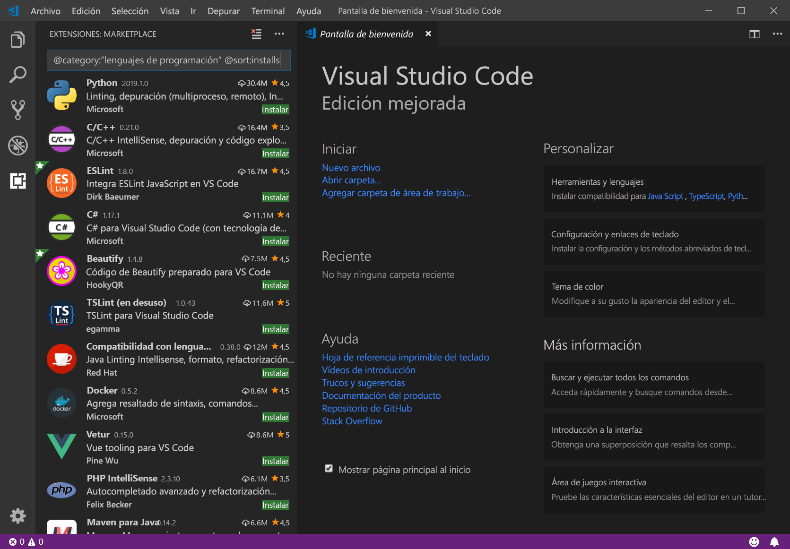
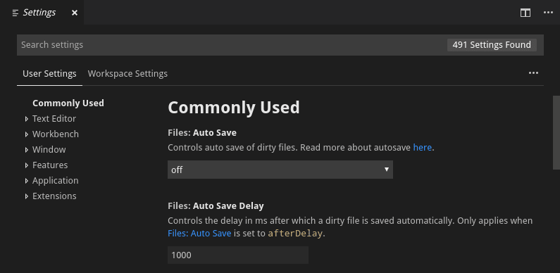
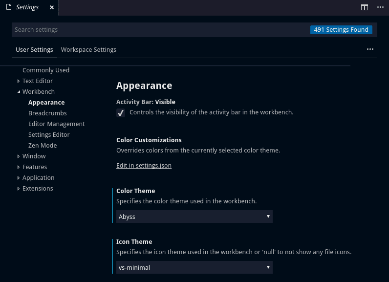
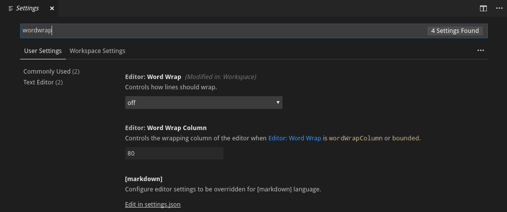
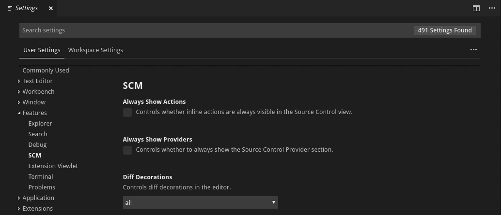

# VS CODE

Descarga e instala este editor de código na túa computarora.

Lembra que cando instales VSCode é conveniente que o engadas ao PATH do teu sistema


### Interface de usuario

Non te deixes enganar pola aparente sinxeleza da interface. É intencional, pero agocha a verdadeira eficacia deste editor. Familiarízate cos compoñentes principais da interface de usuario.


Unha función importante da interface de usuario é a paleta de comandos (F1 en calquera plataforma, Ctrl+Mayús+P en Windows e opción incluída no menú despregable **Ver**). É excelente punto de partida se tes unha idea do que queres facer en  Code, pero non lembras exactamente como.


De forma predeterminada, a paleta de comandos aparece no modo de comandos, indicado polo símbolo do sistema `>`. Este modo inclúe a maior parte das funciones de VS Code, coma a busca de métodos abreviados de teclado. E moito máis. Para obter unha lista, premer `F1 + retroceso` para quitar o símbolo do sistema (`>`)  e escribir un signo de interrogación (`?`). Dedica un momento a explorar isto, serache útil a larga.

### Temas de cor

Cambiar a aparencia do editor é algo importante para maioría de nos. En VSCode resulta moi fácil grazas aos temas. Para mudalo, selecciona **Personalizar** > **Tema de color**.

### Ferramentas e extensións

En **Personalizar**, fai clic en **Herramientas y lenguajes** e verás que o panel da esquerda se expande para amosar a lista actual de extensións dispoñibles. Tamén podes usar o menú **Ver** e seleccionar **Extensiones**. Observa que a primeira opción agrega o filtro `@category:"programming languages"` á lista de extensións, para mostrar só as desa categoría. Pode editar este filtro, ou desactivalo.



Proba instalar unhas poucas:

- Material Theme
- Prettier Now
- Bracket Pair Colorizer
- Live Server

Esta última serache de grande utilidade para as tarefas de desenvolvemento.

## Configuración de VSCode
Podes configurar Visual Studio Code ao teu gusto a través das súas distintas opcións.




VS Code ofrece dous ámbitos diferentes para a configuración:

- **Configuración de usuario** : configuración que **se aplica globalmente** a calquera instancia de VS Code que abras.
- **Configuración do espazo de traballo** : axustes almacenados dentro do teu espazo de traballo e só se aplican cando se abre o espazo de traballo.

A configuración do espazo de traballo anula a configuración do usuario. A configuración do espazo de traballo é específica dun proxecto e pódese compartir entre os desenvolvedores dun proxecto.

## Creando configuración de usuario e espazo de traballo

Para abrir a configuración de usuario e espazo de traballo, usamos o seguinte comando do menú VS Code:

- En Windows/Linux - **Ficheiro** > **Preferencias** > **Configuración**

Tamén pode abrir o editor de Configuración desde a **Paleta de comandos** ( Ctrl+Maiús+P ) con **Preferencias: Abra Configuración** ou use o atallo de teclado ( Ctrl+, ).

No seguinte exemplo, o tema da cor e o tema da icona do ficheiro foron modificados.



Os axustes modificados agora indícanse cunha *liña azul* semellante ás liñas modificadas no editor. A icona da engrenaxe abre un menú contextual con opcións para restablecer a configuración ao seu valor predeterminado, así como copiar a configuración como JSON.

> **Nota: a** configuración do espazo de traballo é útil para compartir a configuración específica do proxecto nun equipo.


## Editor de configuración

Atopar as diferentes opcións de configuración é sinxelo. Podes buscar e descubrir a configuración que buscas usando o buscador integrado.

 

As extensións de VS Code tamén poden engadir a súa propia configuración personalizada e estarán visibles nunha sección de **Extensións** .

### Editar a configuración

Cada configuración pódese editar mediante unha **caixa de verificación** , unha **entrada** ou un **menú despregable** . Edita o texto ou selecciona a opción que queres cambiar á configuración desexada.


### Grupos de configuración

Os axustes predeterminados represéntanse en grupos para que poida navegar por eles facilmente.




## Os arquivos de configuración

De forma predeterminada, VS Code mostra o editor de configuración, pero tamén se pode editar o arquivo `settings.json`  subxacente mediante o comando **Abrir configuración (JSON)**.

Dependendo da plataforma, o arquivo de configuración do usuario se atopa en distintos sitios.

**Windows:** `%APPDATA%\Code\User\settings.json`

O arquivo de configuración do espazo de traballo está situado no cartafol raíz do proxecto, no cartafol `.vscode`.

## Configuración do editor en función da linguaxe

Podes configurar o editor para que responda de xeito adaptado a diferentes linguaxes.

Execute o comando global **Preferencias: Configurar a configuración específica da linguaxe**.  (ID do comando: `workbench.action.configureLanguageBasedSettings`) desde a **Paleta de comandos** ( Ctrl+Maiús+P ) que abre o selector de linguaxe. Selecciona a linguaxe que queiras, isto abre o arquivo `settings.json` para e inclusión da linguaxe na configuración aplicable.


Selecciona o idioma a través do menú despregable:


Engade a configuración específica do idioma á túa configuración de usuario:


A configuración especifica da linguaxe na túa configuración de usuario anula a configuración do espazo de traballo.

Podes axustar a configuración específica da linguaxe ao espazo de traballo colocado no arquivo `settings.json`  as opcións axeitadas para ese espazo de traballo. Se tes axustes definidos para unha linguaxe tanto no ámbito do usuario como no ámbito do espazo de traballo, únense dando prioridade aos definidos no espazo de traballo.

```json
{
  "[typescript]": {
    "editor.formatOnSave": true,
    "editor.formatOnPaste": true
  },
  "[markdown]": {
    "editor.formatOnSave": true,
    "editor.wordWrap": "on",
    "editor.renderWhitespace": "all",
    "editor.acceptSuggestionOnEnter": "off"
  }
}
```

Podes usar IntelliSense mentres editas `settings.json`, para axudarche a atopar a configuración baseada na linguaxe permitida. 

Algunhas linguaxes teñen xa configurados axustes específicos predeterminados, que podes revisar abrindo `defaultSettings.json` co comando **Preferencias: Abrir configuración predeterminada** .

## Preferencia da configuración

As configuracións pódense substituír en varios niveis:

- Configuración de usuario: aplícase globalmente a todas as instancias de VS Code.
- Configuración do espazo de traballo: aplícase ao cartafol ou espazo de traballo aberto e anula a configuración do usuario.
- Configuración do cartafol do espazo de traballo: aplícase a un cartafol específico dun [espazo de traballo multiraíz](https://code.visualstudio.com/docs/editor/multi-root-workspaces) . Anula a configuración do usuario e do espazo de traballo.

Os valores de configuración poden ser de varios tipos:

- **string** - `"files.autoSave": "afterDelay"`
- **booleano** - `"editor.minimap.enabled": true`
- **number** - `"files.autoSaveDelay": 1000`
- **array** - `"editor.rulers": []`
- **object** - `"search.exclude": { "**/node_modules": true, "**/bower_components": true }`

Os valores con tipos primitivos e tipo Array son substituídos, pero os que son de tipo Object únense. Por exemplo, `workbench.colorCustomizations`toma un Obxecto que especifica un grupo de elementos da IU e as cores desexadas.

Se a configuración do usuario establece os fondos do editor en azul e verde:

```json
  "workbench.colorCustomizations": {
    "editor.background": "#000088",
    "editor.selectionBackground": "#008800"
  }
```

E a configuración do teu espazo de traballo aberto configura o primeiro plano do editor en vermello:

```json
  "workbench.colorCustomizations": {
    "editor.foreground": "#880000",
    "editor.selectionBackground": "#00FF00"
  }
```

O resultado, cando ese espazo de traballo está aberto, é a combinación desas dúas personalizacións de cores, coma se especificases:

```
  "workbench.colorCustomizations": {
    "editor.background": "#000088",
    "editor.selectionBackground": "#00FF00",
    "editor.foreground": "#880000"
  }
```

Se hai valores en conflito, como `editor.selectionBackground`no exemplo anterior, o comportamento de substitución habitual ocorre c**os valores do espazo de traballo que teñen prioridade sobre os valores do usuario**.

## Configuración e seguridade

Hai certas opcións de configuración que so se admiten como parte da configuración de usuario e non se poden modificar na configuración do espazo de traballo. Como por exemplo:

- `git.path`
- `terminal.external.windowsExec`

O teu camiño a túa conta de Git, e a liña de comandos por defecto que imos a empregar.


E se o precisas, sempre se pode recuperar a configuración oficial por defecto.


## Información adicional

- [Documentación de Visual Studio Code](https://code.visualstudio.com/docs)
- [Vídeos introductorios](https://code.visualstudio.com/docs/getstarted/introvideos)
- [Visual Studio Code lo puede hacer](https://vscodecandothat.com/)

___

NOV 2021

###### REFERENCIA

- https://code.visualstudio.com/docs
- https://code.visualstudio.com/docs/getstarted/settings
