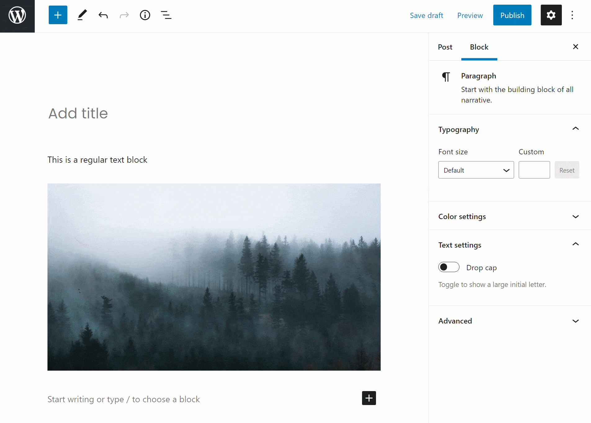

# Introdución a Gutenberg

- **(A)** – permíteche engadir novos bloques. 
- **(B)** – botóns desfacer/refacer 
- **(C)** - ver unha vista de lista (esquema) de todos os seus bloques - útil para navegar rapidamente entre os bloques 
- **(D)** : dáche acceso á configuración do documento, que abarca cousas como  categorías e etiquetas, imaxes destacadas, etc. É semellante á barra  lateral actual do editor de WordPress 
- **(E)** - cando se selecciona un bloque individual, isto dálle acceso a configuracións específicas para ese bloque 
- **(F)** : permíteche acceder a unha vista previa en directo da túa publicación ou publicar/actualizar a túa publicación 
- **(G)** : unha vez que engadas algúns bloques, aquí traballarás co contido da túa publicación 

Gutenberg é un editor baseado en bloques. 

**Edición baseada en bloques 101:** 

Esencialmente, Gutenberg  substitúe o campo de edición do anterior editor TinyMCE de WordPress con moitos "bloques" individuais. 

Estes bloques permítenche crear deseños máis complexos que os que permitia o antigo editor clásico de WP. 

**Que é un bloque?** 

Un bloque pode ser practicamente calquera cousa.  Por exemplo, podes ter bloques para: 

- Texto regular 
- [Imaxes ](https://www.codeinwp.com/blog/free-images-for-blogs/)
- Incrustacións de vídeo 
- Botóns 
- Widgets ( *si, os mesmos widgets que usas na túa barra lateral)* 
- Táboas 
- Etc. 

Asemade os desenvolvedores poderán crear os seus propios bloques, ou empregar bloques de terceiros aos que se pode acceder mediante complementos.

*_ref:* https://www.codeinwp.com/blog/wordpress-gutenberg-guide/
