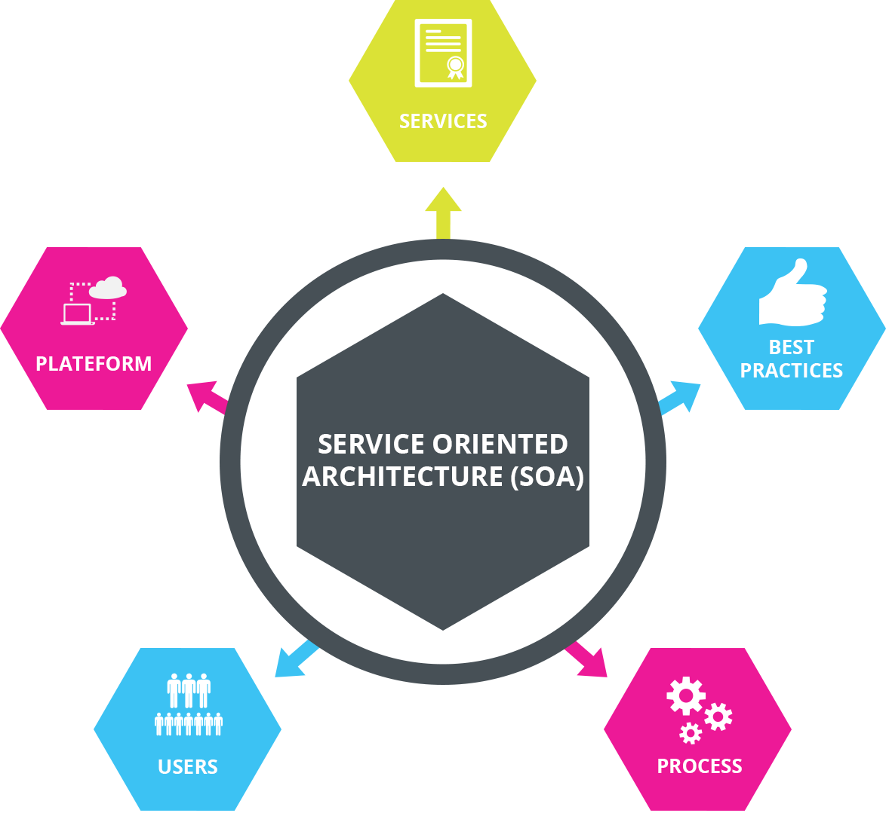
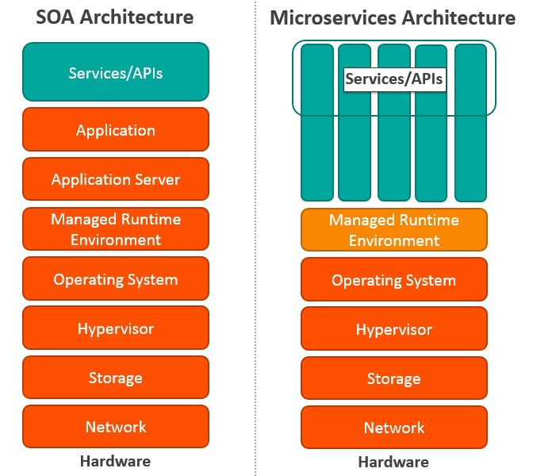

## SOA - Arquitectura orientada a servicios

# Que é a arquitectura orientada a servizos?

A Arquitectura Orientada a Servizos (SOA) é un estilo de deseño de software onde os servizos son proporcionados aos compoñentes da aplicación por outros compoñentes, a través dun protocolo de comunicación a través dunha rede. Os seus principios son independentes dos provedores e doutras tecnoloxías. Na [**arquitectura orientada a servizos**](http://santexgroup.com/) , unha serie de servizos comunícanse entre si de dúas formas: pasando datos ou a través de dous ou máis servizos que coordinan unha actividade. Esta é só unha definición de Arquitectura Orientada a Servizos. [Un artigo na Wikipedia entra en moito máis detalle.](https://en.wikipedia.org/wiki/Service-oriented_architecture#Event-driven_architectures)

# Características da arquitectura orientada a servizos

Mentres the definindo conceptos de Arquitectura Orientada a Servizos varían de empresa a empresa, hai seis principios clave que se refiran o amplo concepto de Arquitectura Orientada a Servizos. Estes valores fundamentais inclúen:

- Valor comercial

- Obxectivos estratéxicos

- Interoperabilidade intrínseca

- Servizos compartidos

- Flexibilidade

- Refinamento evolutivo

Cada un destes valores fundamentais pódese ver nun continuo desde a informática distribuída con formatos máis antigos ata a arquitectura orientada a servizos ata a computación en nube (algo que se adoita ver como unha derivación da arquitectura orientada a servizos).

# Patróns de arquitectura orientada a servizos

Hai **tres roles** en cada un dos bloques de construción da Arquitectura Orientada a Servizos: provedor de servizos; intermediario de servizos, rexistro de servizos, repositorio de servizos; e solicitante/consumidor do servizo.

- O provedor de servizos traballa en conxunto co rexistro de servizos, debatendo os por que e como dos servizos que se ofrecen, como a seguridade, a dispoñibilidade, o que cobrar e moito máis. Este papel tamén determina a categoría de servizo e se é necesario que exista algún acordo comercial.

- O intermediario de servizos pon a disposición de quen o solicite información relativa ao servizo. O alcance do corredor está determinado por quen o implementa.

- O solicitante do servizo localiza as entradas no rexistro do corretor e, a continuación, úneas ao provedor de servizos. Poden ou non poder acceder a varios servizos; que depende da capacidade do solicitante do servizo.

# Implantación de Arquitectura Orientada a Servizos

Cando se trata de implementar a arquitectura orientada a servizos (SOA), hai unha ampla gama de tecnoloxías que se poden utilizar, dependendo do seu obxectivo final e do que estea tentando lograr.

Normalmente, a arquitectura orientada a servizos implícase con servizos web, o que fai que os "bloques de construción funcionais sexan accesibles a través dos protocolos estándar de Internet".

Un exemplo de estándar de servizo web é [SOAP](https://en.wikipedia.org/wiki/SOAP) , que significa Simple Object Access Protocol. En poucas palabras, SOAP “é unha especificación de protocolo de mensaxería para o intercambio de información estruturada na implantación de servizos web en redes informáticas. Aínda que SOAP non tivo unha boa acollida nun principio, desde 2003 gañou máis popularidade e está a ser máis amplamente utilizado e aceptado. Outras opcións para implementar a Arquitectura Orientada a Servizos inclúen Jini, COBRA ou REST.

É importante ter en conta que as arquitecturas poden "operar independentemente de tecnoloxías específicas", o que significa que se poden implementar de diversas formas, incluída a mensaxería, como ActiveMQ; Apache Thrift; e FEIXO.

# Por que é importante a arquitectura orientada a servizos

Hai moitos [beneficios para a arquitectura orientada a servizos](https://www.bmc.com/blogs/service-oriented-architecture-overview/) , especialmente nun negocio baseado en servizos web. Describiremos algúns destes beneficios aquí, en breve:

Use a arquitectura orientada ao servizo para crear código reutilizable: isto non só reduce o tempo dedicado ao proceso de desenvolvemento, senón que non hai razón para reinventar a roda de codificación cada vez que necesite crear un novo servizo ou proceso. A arquitectura orientada a servizos tamén permite usar varias linguaxes de codificación porque todo se executa a través dunha interface central.

Use a Arquitectura Orientada a Servizos para promover a interacción: coa Arquitectura Orientada a Servizos ponse en marcha unha forma estándar de comunicación, que permite que os distintos sistemas e plataformas funcionen independentemente entre si. Con esta interacción, a Arquitectura Orientada a Servizos tamén pode funcionar con cortalumes, permitindo que "as empresas compartan servizos que son vitais para as operacións".

Use a arquitectura orientada a servizos para a escalabilidade: é importante poder escalar unha empresa para satisfacer as necesidades do cliente, pero certas dependencias poden obstaculizar esa escalabilidade. O uso da Arquitectura Orientada ao Servizo reduce a interacción cliente-servizo, o que permite unha maior escalabilidade.

Use a arquitectura orientada a servizos para reducir custos: Coa Arquitectura Orientada a Servizos, é posible reducir os custos mantendo o nivel de saída desexado. Usar a arquitectura orientada a servizos permite ás empresas limitar a cantidade de análise necesaria ao desenvolver solucións personalizadas.

# Como funcionan xuntos a arquitectura orientada a servizos e a computación en nube

En primeiro lugar, é importante ter en conta que a Arquitectura Orientada a Servizos pode funcionar con ou sen computación en nube, aínda que cada vez son máis as empresas que moven o almacenamento de ficheiros á nube, polo que ten sentido usar a computación en nube e a Arquitectura Orientada a Servizos xuntos.

En poucas palabras, [o uso da computación na nube](https://www.oracle.com/technetwork/articles/soa/ind-soa-cloud-2190513.html) permite aos usuarios implementar de xeito sinxelo e inmediato servizos adaptados aos requisitos dos seus clientes, "sen necesidade de consultar un departamento de TI".

Unha desvantaxe do uso conxunto da Arquitectura Orientada a Servizos e da computación en nube é que algúns aspectos desta non se avalían, como a seguridade e a dispoñibilidade. Cando se usa a computación en nube, os usuarios adoitan estar a mercé do provedor.

Hai un desafío bastante importante ao que se enfrontan as empresas ao fusionar a computación en nube e a arquitectura orientada a servizos é a integración dos datos e sistemas existentes na solución na nube. Debe haber continuidade de principio a fin para que haxa unha transición sen fisuras. Tamén é importante ter en conta que non todos os aspectos de TI se poden terceirizar á nube; hai algunhas cousas que aínda hai que facer manualmente.

Podes ler máis sobre como [funcionan xuntos a arquitectura orientada a servizos e a computación na nube aquí mesmo](https://www.oracle.com/technetwork/articles/soa/ind-soa-cloud-2190513.html) .

# A diferenza entre a arquitectura orientada a servizos e SaaS

Falamos bastante sobre o que é a Arquitectura Orientada a Servizos e como se pode usar para facer avanzar o seu negocio. Pero tamén hai [SaaS (Software as a Service)](https://apprenda.com/library/architecture/soa-vs-saas-whats-the-difference/) , que tamén se pode usar para facer avanzar o seu negocio. Quizais se estea preguntando que é SaaS e en que se diferencia da Arquitectura Orientada a Servizos. En resumo, os recursos dispoñibles a través de SaaS son aplicacións de software. Un compoñente clave é que a infraestrutura SaaS está "dispoñible para os usuarios, pero oculta aos usuarios". Unha vantaxe de SaaS é que os usuarios non teñen que instalar e manter software, o que elimina calquera requisito complexo. Con SaaS, o cliente tampouco require ningunha licenza inicial, o que leva a custos máis baixos porque os provedores só manteñen unha única aplicación.

# Diferenzas entre a arquitectura orientada a servizos e os microservizos

Os microservizos, tamén coñecidos como Microservice Architecture, son un "estilo arquitectónico que estrutura unha aplicación como unha colección de pequenos servizos autónomos, modelados arredor dun dominio empresarial".

Aínda que os microservizos e a arquitectura orientada a servizos son similares nalgúns aspectos, as principais diferenzas veñen na súa funcionalidade. Os servizos son, obviamente, o principal compoñente de ambos. Existen catro tipos básicos de servizos:

Servizo funcional: definen as operacións comerciais básicas

Servizo empresarial: estes implementan a funcionalidade definida polos servizos funcionais

Servizo de aplicacións: están limitados a contido específico da aplicación

Servizo de infraestrutura: implementa tarefas non funcionais como autenticación, auditoría, seguridade e rexistro.

Como podes ver, cada un destes servizos baséase no anterior, creando un sistema que non só é fácil de usar, senón que che proporciona unha variedade de formas de xestionar a túa empresa. Como con calquera funcionalidade, trátase de descubrir o que funciona mellor para ti e para a túa empresa.

[Podes ler máis sobre a arquitectura orientada a servizos e os microservizos aquí](https://www.quora.com/What-is-the-difference-between-SOA-and-microservices) .

Non importa a dirección que decidas tomar para ofrecer servizos aos teus clientes, é importante ter en conta que as distintas cousas funcionarán para diferentes persoas. E aínda que non poidas ofrecer servizos personalizados para cada potencial cliente, si podes ofrecer unha gama de servizos que se axusten ás necesidades máis comúns dos clientes probables.

`` Web 2.0``, ``microservizos``,  ``SOA``.

_.ref.:_ *https://medium.com/@SoftwareDevelopmentCommunity/what-is-service-oriented-architecture-fa894d11a7ec*